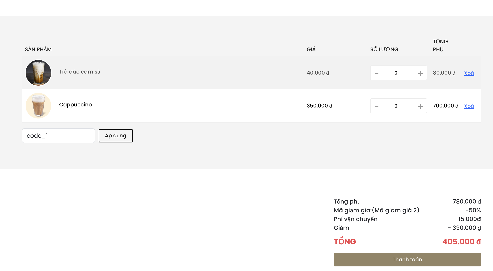

# Introduce E-commerce project

## Tools used:
* API: PHP(Laravel)
* Frontend: Vue js
* Database: MySQL

## Database

# Pages
## User Page
* Log in, sign up

## Home page

## Menu
* **Arrange** 
 * Rating
 * Price
 * Popular
* **Filter**
 * Category
 * Rating
 * Price 
* Pagination
* 
*Product details.
## Cart

* CRUD: product
* Discount code
## Payment

